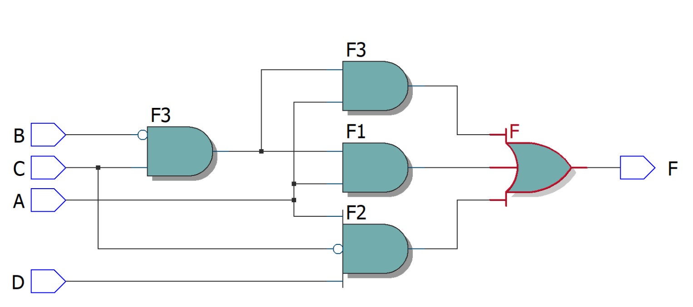

# Experiment--04-Implementation-of-combinational-logic-using-universal-gates-
 ## Implementation-of-Half-subtractor-and-Full-subtractor-circuit
## AIM:
To implement the given logic function using NAND and NOR gates and to verify its operation in Quartus using Verilog programming.
F=((C'.B.A)'(D'.C.A)'(C.B'.A)')' using NAND gate
F=(((C.B'.A)+(D.C'.A)+(C.B'.A))')' using NOR gate

## Equipments Required:
## Hardware – PCs, Cyclone II , USB flasher
## Software – Quartus prime
## Theory
 
 
 
 

## Procedure

Write the detailed procedure here 

## Program:
/*
~~~
Program to design a Implementation of combinational logic using universal gates-  and verify its truth table in quartus using Verilog programming.
Developed by: Anusha R
RegisterNumber:  212221230006

NAND:

module ex04(A,B,C,D,F);
wire F1,F2,F3;
input A,B,C,D;
output F;
assign F1=(C & ~B & ~A);
assign F2=(D & ~C & ~A);
assign F3=(~C & B & ~A);
assign F=(~F1 & ~F2 & ~F3);
endmodule

NOR:

module ex04(A,B,C,D,F);
input A,B,C,D;
output F;
wire F1,F2,F3;
assign F1=(C & ~B &A);
assign F2=(D & ~C & A);
assign F3=(C & ~B & A);
assign F=((F1|F2|F3));
endmodule
~~~
*/

## Output:
### NAND
### Truth table

### RTL realization

### Timing diagram

### NOR
### Truth table

### RTL realization

### Timing diagram

## Result:
Implementation of the given logic function using NAND and NOR gates is done and verification its operation in Quartus using Verilog programming is carried out sucessfully.
 
